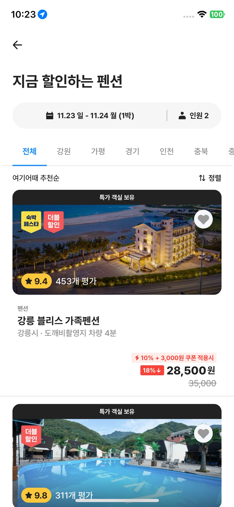
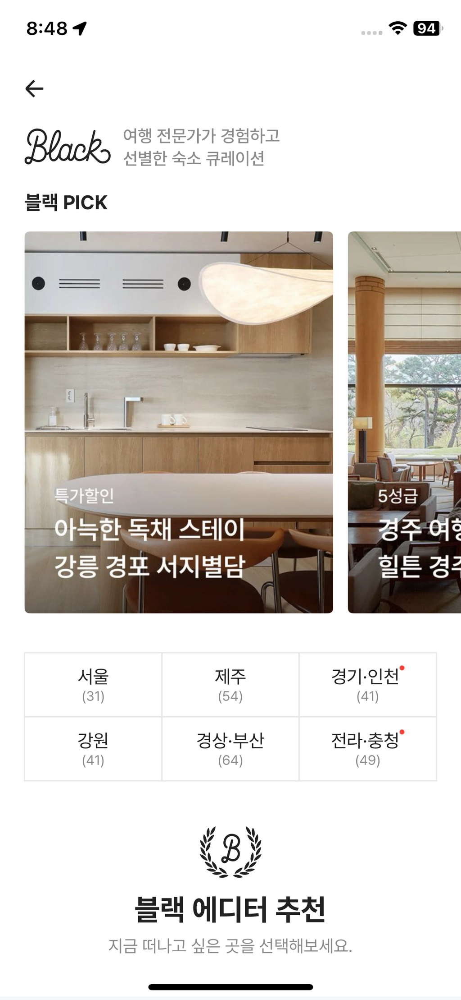
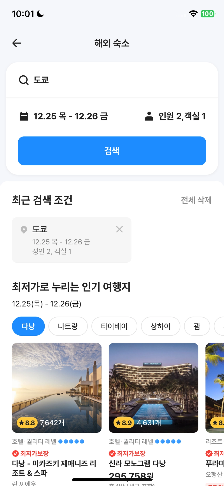
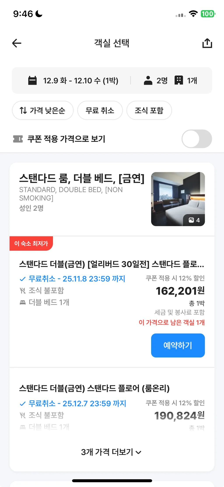
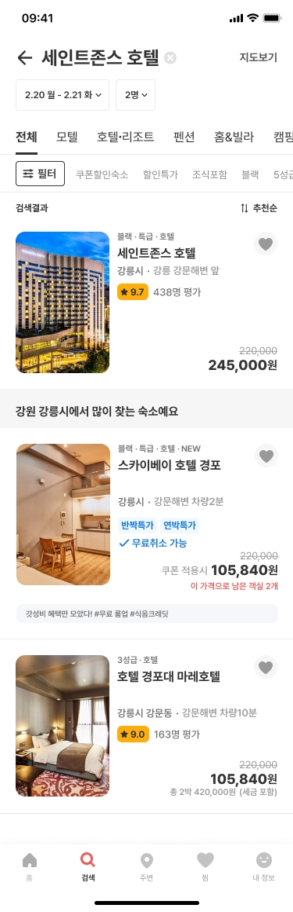
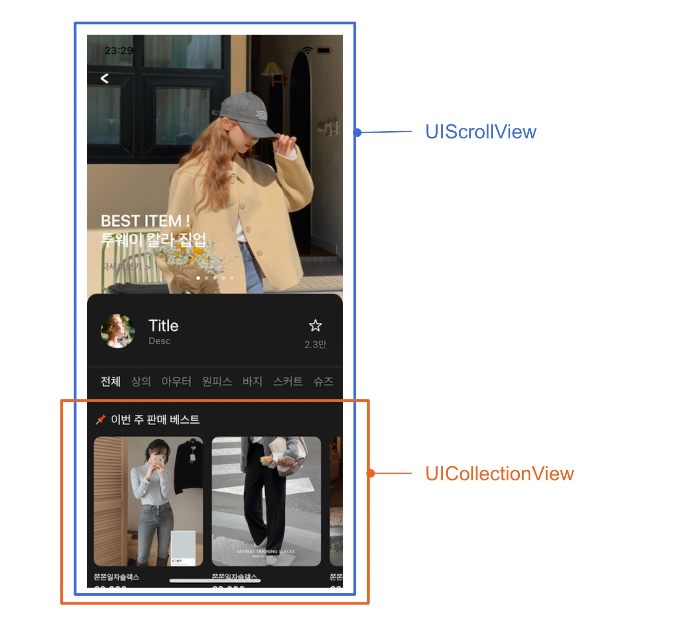
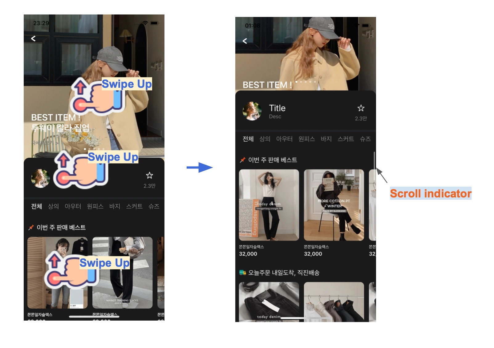
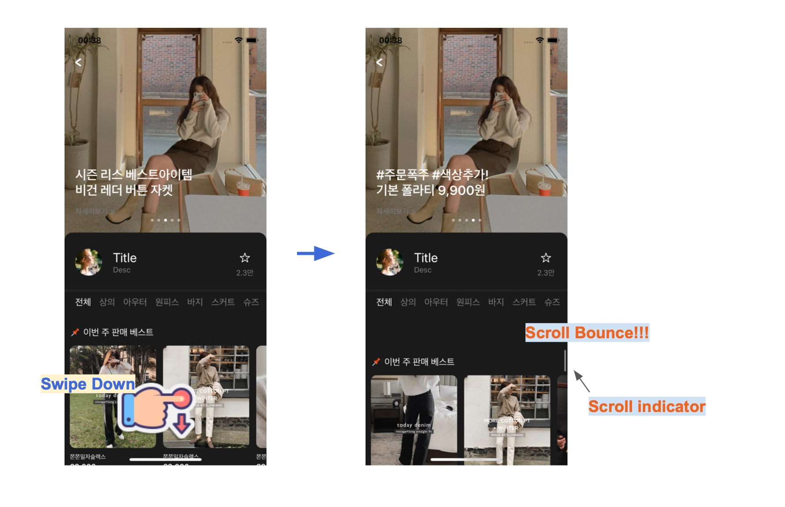
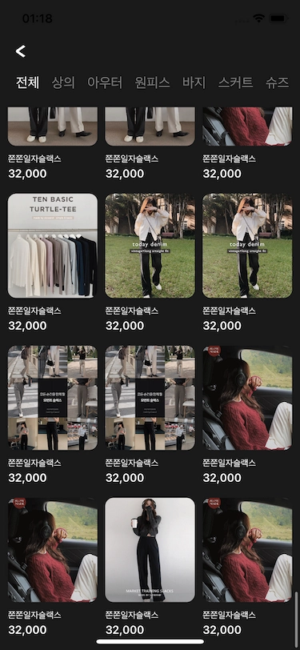
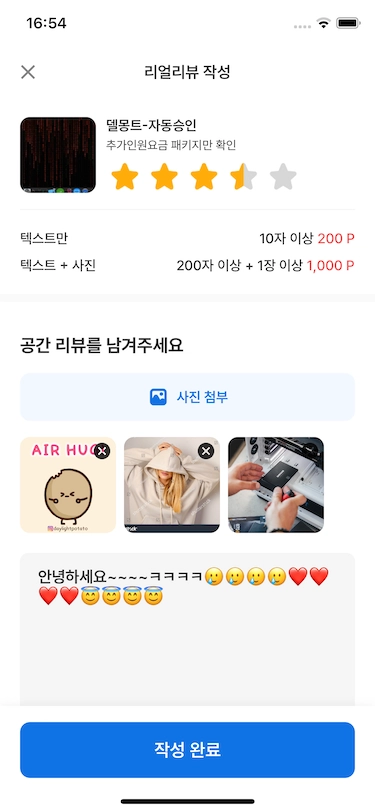

# Portfolio

> iOS 개발자 포트폴리오  
> 📎 [Notion 원본 보기](https://ginger-paw-ca6.notion.site/Portfolio-3fc6fdcebdd546f7b0aca42876643182)

---

## Projects

### 1. 호텔, 펜션 ThemeListingsPage

| 항목 | 내용 |
|------|------|
| **개발기간** | 2025.03 ~ 2025.04 |
| **사용기술** | UIKit, ReactorKit, SnapKit, UICollectionViewCompositionalLayout |

- 셀러펀딩, 수수료 오버라이드 TLP
- 특정 조건에 부합하는 제휴점이 자동으로 리스트업되는 화면 개발

| 스크린샷 | 시연영상 |
|:---:|:---:|
|  | [▶ 시연영상](assets/01_호텔펜션_ThemeListingsPage/RPReplay_Final1762521785_(1).mp4) |

---

### 2. 블랙 홈, 리스트 화면 SwiftUI 전환

| 항목 | 내용 |
|------|------|
| **개발기간** | 2025.01 ~ 2025.02 |
| **사용기술** | SwiftUI |

- 기존 UIKit으로 되어있는 블랙 홈, 리스트 화면을 SwiftUI로 전환

| 스크린샷 | 시연영상 |
|:---:|:---:|
|  | [▶ 시연영상](assets/02_블랙홈_SwiftUI전환/RPReplay_Final1762559263_(1).mp4) |

---

### 3. 해외숙소 홈 개편

| 항목 | 내용 |
|------|------|
| **개발기간** | 2024.07 ~ 2024.09 |
| **사용기술** | UIKit, ReactorKit, SnapKit, UICollectionViewCompositionalLayout |

- 해외숙소 홈 개선 작업으로 Web 화면을 네이티브 앱 화면으로 변환

| 스크린샷 | 시연영상 |
|:---:|:---:|
|  | [▶ 시연영상](assets/03_해외숙소_홈개편/RPReplay_Final1762521132_(1).mp4) |

---

### 4. 해외숙소 ILP 룸그룹핑

| 항목 | 내용 |
|------|------|
| **개발기간** | 2024.02 ~ 2024.04 |
| **사용기술** | UIKit, ReactorKit, SnapKit, UICollectionViewCompositionalLayout |

- 객실 타입별로 그룹핑하고 해당 그룹에 맞는 UX/UI를 제공하여 객실 탐색이 용이하게 함

| 스크린샷 | 시연영상 |
|:---:|:---:|
|  | [▶ 시연영상](assets/04_해외숙소_ILP_룸그룹핑/RPReplay_Final1762519370_(1).mp4) |

---

### 5. Hackle A/B 테스트

A/B 테스트를 통한 UX 개선 실험

#### 5-1. 캘린더 내부 요금 표기

| 항목 | 내용 |
|------|------|
| **개발기간** | 2023.02 ~ 2023.03 |
| **사용기술** | ReactorKit, MVVM, SnapKit |

- 캘린더 일자별 가격 노출 A/B 테스트

| 기존 Test Group A | Test Group B |
|:---:|:---:|
|  |  |

#### 5-2. 숙소 셀러카드 개선 작업

| 항목 | 내용 |
|------|------|
| **개발기간** | 2023.04 ~ 2023.05 |
| **사용기술** | ReactorKit, MVVM, SnapKit |

| 기존 - Test Group A | Test Group B (파노라마 뷰) | Test Group C (썸네일 뷰) |
|:---:|:---:|:---:|
|  |  |  |

#### 5-3. 제휴점 자동완성 Flow 변경 실험

| 항목 | 내용 |
|------|------|
| **개발기간** | 2023.08 ~ 2023.09 |
| **사용기술** | ReactorKit, MVVM, SnapKit |

- Test Group B: 검색한 숙소와 함께 유사 숙소 추천리스트를 보여줌
- Test Group C: 검색한 숙소와 해당 숙소의 주소 기준 지역 검색(시, 군, 구 검색)한 결과를 함께 보여줌

| 기존 - Test Group A | Test Group B | Test Group C | Test Group B, C |
|:---:|:---:|:---:|:---:|
|  |  |  |  |

---

### 6. 지그재그 클론코딩

| 항목 | 내용 |
|------|------|
| **사용기술** | UICollectionViewCompositionalLayout, UICollectionViewDiffableDataSource |

**UI 구성:**

**1) 위로 스크롤 시 UICollectionView가 올라오는 인터랙션**

  

**2) UICollectionView 영역에서 위로 스크롤 시 Scroll indicator 표시**

  

**3) 아래로 스크롤 시 Bounce 처리 + Scroll indicator**

  

**4) 마지막까지 스크롤 시 새로운 데이터 추가 (Infinite Scroll)**

  

[▶ 시연영상](assets/06_지그재그_클론코딩/RPReplay_Final1666791690_(1).mp4)

---

### 7. 리뷰 작성 화면 개발

| 항목 | 내용 |
|------|------|
| **개발기간** | 2022.09 |
| **사용기술** | ReactorKit, MVVM, SnapKit, Feature 모듈화 |

- 숙소, 상품 구매 후 리뷰 작성 화면 개발
- **특이사항**: 리뷰 텍스트로 작성할 수 있는 모든 문자, 이모지는 공백을 포함하여 5회 이상 동일 글자 입력을 제한

| 스크린샷 | 시연영상 |
|:---:|:---:|
|  | [▶ 시연영상](assets/07_리뷰작성화면/RPReplay_Final1666857153_(1).mp4) |

---

### 8. 해외숙소 프로젝트

| 항목 | 내용 |
|------|------|
| **개발기간** | 2022.02 ~ 2022.07 |
| **사용기술** | ReactorKit, MVVM, SnapKit, Feature 모듈화 |
| **참여인원** | 실무 참여자 93명 (iOS 3명, AOS 3명) |
| **역할** | iOS 개발 파트 리드 |

#### 프로젝트 소개

아고다의 숙소 데이터를 여기어때 플랫폼에 연동해 해외 숙소를 직접 판매할 수 있도록 하는 대규모 프로젝트로, 약 100명에 가까운 인력이 참여했습니다.

**담당 기능:**
- 숙소 리스트 화면
- 필터 적용 화면
- 구글 맵 기반 지도 화면 (숙소 위치 및 가격 마커 표시)
- 결제 페이지 (WebView 연동)

**주요 성과:**
- 백엔드 일정 지연 상황에서 Mock 데이터를 활용해 화면 구조를 미리 완성하고, API 오픈 즉시 연동 가능한 구조 설계
- 팀 내 우선순위 조정과 코드 리뷰를 통한 팀워크 유지
- 정해진 일정 내 안정적 런칭 성공, 2022년 여름 성수기 시즌에 맞춰 서비스 안착

#### 협업 경험과 인사이트

해외숙소 연동 프로젝트 진행 당시 가장 큰 협업 이슈는 서버(API) 개발 일정 지연이었습니다. 전체 일정은 이미 확정되어 있었고, 여름 성수기 전에 반드시 출시해야 하는 상황이었습니다.

iOS팀은 3명으로 구성되어 있었고, 저는 해외숙소 파트 iOS 리드 개발자로서 팀 내 일정 조율과 품질 관리 모두를 책임졌습니다. 백엔드 일정이 맞춰지지 않는 구간에서는 Mock 데이터를 활용해 화면 구조를 미리 완성하고, 이후 실제 API가 열렸을 때 빠르게 연동할 수 있도록 설계를 진행했습니다.

일정 압박 속에서도 팀원들과 매일 진행 상황을 공유하고 기술적 어려움을 함께 논의하며 심리적 부담을 최소화하려고 노력했습니다. 결과적으로 프로젝트는 정해진 일정 내에 안정적으로 런칭되었고, 서비스 초기에 큰 오류 없이 운영되었습니다.

이 경험을 통해 리더십이란 단순히 업무를 분배하는 것이 아니라, 팀이 끝까지 나아갈 수 있도록 책임을 함께 지는 태도임을 배웠습니다.

[▶ 시연영상](assets/08_해외숙소_프로젝트/RPReplay_Final1661730333_(1)_(5).mp4)

---

### 9. FamilyConcert Game 개발 (Android TV App)

| 항목 | 내용 |
|------|------|
| **개발기간** | 2013.01 ~ 2013.05 |
| **사용기술** | Android, cocos2d-x |

중국 TCL에서 의뢰받은 프로젝트로, Android 4.1.2 스마트 TV에 탑재되는 리듬액션 게임입니다.

**주요 구현:**
- 스마트TV에 88키 전자피아노를 1대 이상 연결하여 게임 플레이
- MIDI 음악 파일을 분석하여 건반 노트를 생성
- 피아노 원가 절감을 위해 피아노 소리 출력을 제거하고, 앱에서 피아노 건반 신호를 받아 General MIDI (128가지 악기) 출력
- cocos2d-x를 이용한 피아노 교육 및 게임 앱

[▶ 시연영상](assets/09_FamilyConcert_Game/12436837415_20191211232833044_(1).mov)

---

## 기술블로그

- [온디바이스 AI vs 서버 AI: Apple Intelligence가 보여준 프라이버시 전략](https://techblog.gccompany.co.kr/asdf-6c1918f97c9c)
- [해외숙소 홈 개편기](https://medium.com/gccompany/%ED%95%B4%EC%99%B8%EC%88%99%EC%86%8C-%ED%99%88-%EA%B0%9C%ED%8E%B8%EA%B8%B0-b1946806a843)
